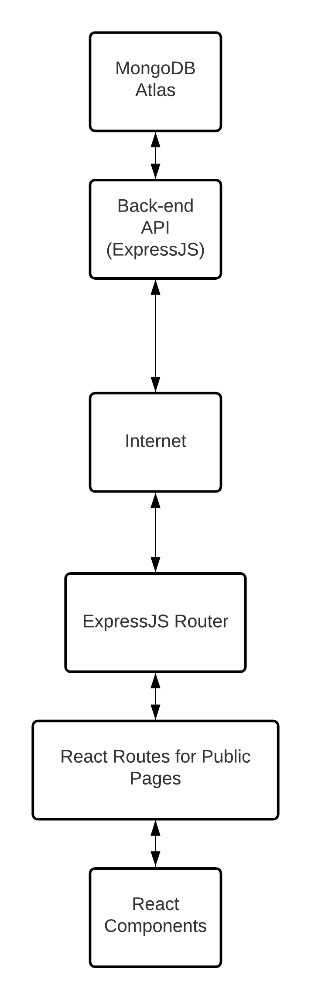

# SCHED-IT

This web application is designed to optimize the process of planning activities that can be invite-based but more importantly, appointment-based.
Users can create invite links to appointments for events that they create and these invited participants are able to select their appointment slots with ease. This idea was initially born due to the need for the Lasallian Youth Orchestra's web application to incorporate an appointment system.


Click [here](https://sched-it-front.herokuapp.com/) for the live demo on Heroku.

You may use the following test account details to login:
<table>
    <tr>
        <th>Email Address</th>
        <th>Password</th>
    </tr>
    <tr>
        <td>adriel_amoguis@dlsu.edu.ph</td>
        <td>Password_1</td>
    </tr>
    <tr>
        <td>renzo_querol@dlsu.edu.ph</td>
        <td>Password_1</td>
    </td>
</table>

## Contents
Each directory of this repository has its own ```README.md``` that further explains the content of the subfolder.
- [front-end](./front-end) - This folder holds an ExpressJS server that is responsible for all HTTP/HTTPS requests to-and-from the front-end as well as data handling from the MongoDB Atlas server.
- [back-end](./back-end) - This folder holds the ExpressJS-powered front-end that was developed using ReactJS.
- [readme-assets](./readme-assets) - This folder holds the images and other assets used in all the READMEs of this repository.

## Installation & Setup
1. Install NodeJS and check the version. This NodeJS project was built for NodeJS 14.x and higher. To check, open a command terminal and run:
    ```
    node -v
    ```
2. Clone this repository using Git bash, Git GUI, or GitHub desktop. For Git bash:
    ```
    git clone https://github.com/DLSU-CCAPDEV/2021T2-G44.git
    ```
3. Navigate to the repository directory, select the stack you want to install (front-end or back-end) and navigate to that directory:
    ```
    cd 2021T2-G44/front-end
    ```
    OR
    ```
    cd 2021T2-G44/back-end
    ```
4. Install the Node project dependencies:
   ```
   npm install
   ```
5. Refer to the ```front-end``` or ```back-end``` folder README for further setup instructions (env, npm scripts).

## Running the Appliation
The front-end and back-end servers have different start-up procedures. Please refer to their respective README files in the respective folders.

## About the Application
This application's system design follows the two-server (or more) design where a server is dedicated to serve front-end static pages and JavaScript, while the other server is dedicated to be the back-end DataAPI. This allows for horizontal flexibility, ready to scale when needed. This system design is common (?) in the enterprise setting, especially with the emergence of containerized applications with Docker and services like Kubernetes.

**The System Design is as follows:**



## Authors: The Lasallian Youth Orchestra Development Team
<table>
    <tr>
        <th>Adriel Isaiah Amoguis</th>
        <th>Lorenzo Querol</th>
        <th>Gian Joseph Madrid</th>
    </tr>
    <tr>
        <td></td>
        <td></td>
        <td></td>
    </tr>
    <tr>
        <td><a target="_blank" href="https://github.com/AdrielAmoguis">GitHub</a></td>
        <td><a target="_blank" href="https://github.com/lorenzoQuerol">GitHub</a></td>
        <td><a target="_blank" href="https://github.com/gianissimo0829">GitHub</a></td>
    </tr>
</table>

## Note to the Reader
If you find any bugs or issues with our design or implementation, please feel free to open a GitHub issue here on this repository. This will be greatly appreciated as it helps us grow into better developers. Please be constructive though!

Thanks for reading and showing interest to our application!

## Acknowledgements

## Appendices
